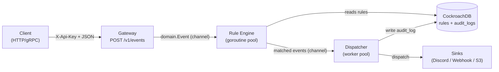
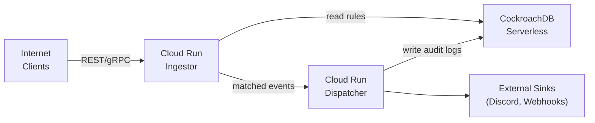

# Architecture

## System Overview

Zenith is a distributed event observer with three layers: **Ingestor** (ingestion), **Rule Engine** (evaluation), and **Dispatcher** (routing).

### Local Pipeline



### Cloud Deployment (GCP)



**Supporting GCP Services:**

| Service | Purpose |
|---|---|
| **Artifact Registry** | Docker image storage (tagged with git SHA) |
| **Secret Manager** | Secure injection of `DATABASE_URL`, `API_KEY_SALT` |
| **Cloud Trace** | Distributed tracing — OTel spans visualized here |
| **Managed Prometheus** | Metrics scraping from Ingestor `/metrics` endpoint |
| **Workload Identity** | Keyless authentication (Cloud Run → Secret Manager) |

---

## Domain Model

### Source

An event producer identified by name and API key.

```go
type Source struct {
    ID     int
    Name   string  // e.g., "payment-service"
    APIKey string  // hashed
}
```

**Rules are scoped to a source** — each source has its own set of rules. This allows different teams to manage their own routing logic independently.

### Rule

A condition + target action, linked to a source.

```go
type Rule struct {
    ID           int
    SourceID     int
    Name         string              // e.g., "high-value-alert"
    Condition    json.RawMessage     // {"field":"amount","operator":">","value":1000}
    TargetAction string              // "https://webhook.url" or "discord-channel-id"
    IsActive     bool
}
```

**Condition structure:**
```json
{
  "field": "amount",
  "operator": ">",
  "value": 1000
}
```

**Supported operators:** `==`, `!=`, `>`, `>=`, `<`, `<=` (numeric and string payloads)

### Event

An inbound event with payload evaluated against rules.

```go
type Event struct {
    ID           string                 // "evt-001"
    Type         string                 // "payment.completed"
    Source       string                 // "payment-service"
    Payload      []byte                 // JSON
    Timestamp    time.Time
    TraceContext map[string]string      // W3C traceparent propagation
}
```

---

## Layer Details

### Ingestor (`cmd/ingestor/`, `internal/ingestor/`)

**Responsibility:** Receive events, validate, authenticate, enqueue to pipeline.

**Entry point:** `cmd/ingestor/main.go`

**Components:**
- **HTTP Server** (`internal/ingestor/server.go`) — Listens on `PORT` (default 8080), serves REST + gRPC
- **REST Gateway** (`internal/gateway/handler.go`) — Handles `POST /v1/events` with authentication
- **Metrics Server** — Listens on `METRICS_PORT` (default 8082) for Prometheus scraping
- **Event Pipeline** (`internal/engine/pipeline.go`) — In-process Go channel connecting Gateway to Rule Engine

**Graceful shutdown:** Stops accepting new connections, drains in-flight events through the pipeline, then exits. See [GETTING_STARTED.md](GETTING_STARTED.md#graceful-shutdown).

### Rule Engine (`internal/engine/`)

**Responsibility:** Evaluate events against rules from CockroachDB.

**Components:**
- **Pipeline** (`internal/engine/pipeline.go`) — Manages goroutine worker pool and event channels
- **Worker** (`internal/engine/worker.go`) — Processes events from input channel, calls Evaluator, sends matches to output channel
- **Evaluator** (`internal/engine/evaluator.go`) — Evaluates event payload against a rule's condition

**Worker pool:** Configurable via `ENGINE_WORKER_COUNT` (default 10). Each worker is a goroutine that pulls events from the input channel and evaluates rules.

**Concurrency:** All evaluation is non-blocking via channels. No locks; no shared state between workers.

### Dispatcher (`cmd/dispatcher/`, `internal/dispatcher/`)

**Responsibility:** Route matched events to external sinks, write audit logs.

**Entry point:** `cmd/dispatcher/main.go`

**Components:**
- **Dispatcher** (`internal/dispatcher/dispatcher.go`) — Orchestrates worker pool and sink routing
- **Sink Registry** (`internal/dispatcher/registry.go`) — Routes to sink implementations by type
- **Sink Implementations** (`internal/dispatcher/sinks/`) — Discord, HTTP webhook, S3, etc.

**Worker pool:** Configurable; each worker pulls matched events from the queue and dispatches to sinks.

**Audit Log:** Every dispatch outcome (success/failure) is written to `audit_logs` table.

---

## Data Flow

### Event Lifecycle

1. **Client sends event** → `POST /v1/events` with `X-Api-Key` header
2. **Gateway validates** → Checks auth, parses JSON, enqueues to pipeline
3. **Rule Engine evaluates** → Fetches rules for source, evaluates condition against payload
4. **Dispatcher routes** → For each matched rule, dispatch event to sink
5. **Audit log recorded** → Outcome (success/failure) written to DB

### Database Schema

Three main tables:

```sql
CREATE TABLE sources (
    id SERIAL PRIMARY KEY,
    name VARCHAR(255) UNIQUE,
    api_key VARCHAR(255) UNIQUE
);

CREATE TABLE rules (
    id SERIAL PRIMARY KEY,
    source_id INT REFERENCES sources(id) ON DELETE CASCADE,
    name VARCHAR(255),
    condition JSONB,
    target_action VARCHAR(2048),
    is_active BOOLEAN
);

CREATE TABLE audit_logs (
    id SERIAL PRIMARY KEY,
    event_id VARCHAR(255),
    source_id INT REFERENCES sources(id),
    rule_id INT REFERENCES rules(id),
    sink_type VARCHAR(255),
    status VARCHAR(32),  -- SUCCESS, FAILED
    error_message TEXT,
    created_at TIMESTAMP
);
```

---

## Concurrency Model

### Ingestor + Rule Engine

**Single process (Phase 4):**
- Gateway and Rule Engine run in the same process
- Communication via in-process Go channels (fastest, lowest latency)
- Event enqueued to Rule Engine immediately; no network hop

**Channel-based concurrency:**
- Ingestor enqueues to `engine_in` channel
- Rule Engine workers pull from `engine_in`, evaluate, send to `engine_out` channel
- Dispatcher pulls from `engine_out`, dispatches to sinks

**No shared state:** Each worker is independent; no mutex locks needed.

### Dispatcher

**Separate process (Phase 4):**
- Dispatcher is a standalone binary
- Receives matched events from Rule Engine (via in-process channel for local, or message broker for cloud)
- Worker pool dispatches to sinks concurrently

---

## Scalability & Future

### Current (Phase 4)

**Constraint:** Ingestor and Dispatcher are tightly coupled in a single process via Go channels. Scaling one requires scaling both.

**Advantage:** Sub-millisecond latency (in-process channels, no network overhead).

**Good for:** Single-digit RPS to hundreds of RPS per container.

### Phase 5 (Planned)

**Change:** Extract Rule Engine into a standalone service. Introduce a message broker (NATS, Kafka, or GCP Pub/Sub) between Ingestor and Rule Engine.

**Architecture:**
```
[Ingestor] ---> [Message Broker] ---> [Rule Engine] ---> [Dispatcher]
```

**Benefits:**
- Independent scaling: scale Ingestor ≠ scale Rule Engine
- Decouple throughput from evaluation capacity
- Async batching for higher throughput
- Multi-language rule evaluation (not just Go)

**Tradeoff:** Slightly higher latency (~100ms instead of ~1ms) due to network hops and message queue buffering.

---

## Code Organization

```
internal/
  domain/           # Core models: Source, Rule, Event
  config/           # Env var loading

  gateway/          # HTTP REST handler (POST /v1/events)
  ingestor/         # gRPC IngestorService

  engine/           # Rule Engine: Pipeline, Worker, Evaluator

  dispatcher/       # Dispatcher logic
  dispatcher/sinks/ # Sink implementations

  repository/       # Abstraction layer (interfaces)
  repository/postgres/ # CockroachDB implementations

  storage/          # DB connection pool
  telemetry/        # OTEL TracerProvider + Prometheus Metrics

cmd/
  ingestor/         # Ingestor binary
  dispatcher/       # Dispatcher binary
  load-generator/   # Load testing utility
```

---

## Design Decisions

### No ORM

Raw SQL queries via `database/sql` and `pgx/v5`. Rationale: Full control over queries, indexes, performance. CockroachDB is SQL-compatible; no benefit from an ORM.

### 12-Factor Config

All configuration from environment variables. No config files, no CLI flags. Makes deployment uniform across local, Kubernetes, and Cloud Run.

### In-Process Channels (Phase 4)

Go channels for Ingestor ↔ Rule Engine communication. Rationale: Lowest latency, simplest concurrency model. Will be replaced with message broker in Phase 5.

### Separate Dispatcher Binary

Dispatcher is a separate process. Rationale: Different concerns (ingestion vs. dispatch). Can be tuned independently. Easier to scale dispatch separately in Phase 5.

### Graceful Shutdown

On SIGTERM: stop accepting new connections, drain all in-flight events, then exit. Prevents event loss during rolling deployments.

### Distributed Tracing

OpenTelemetry SDK integrated into every request path. Every event is traceable from ingestion through dispatch. Enables debugging and performance monitoring at scale.

---

## Observability

See [OBSERVABILITY.md](OBSERVABILITY.md) for:
- Distributed tracing with OpenTelemetry
- Prometheus metrics
- Grafana dashboard
- Example PromQL queries
